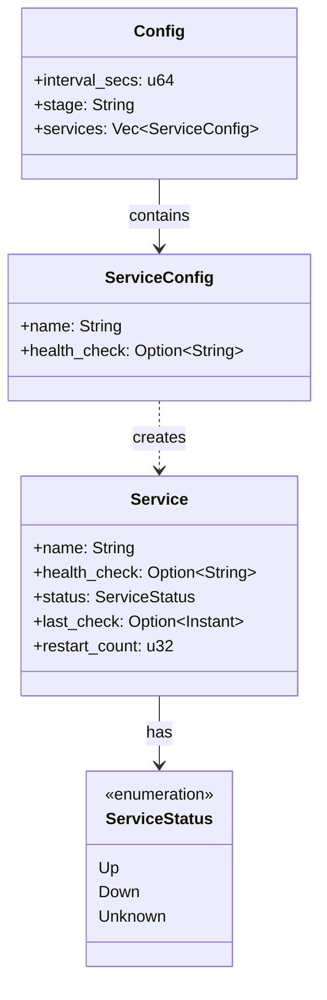
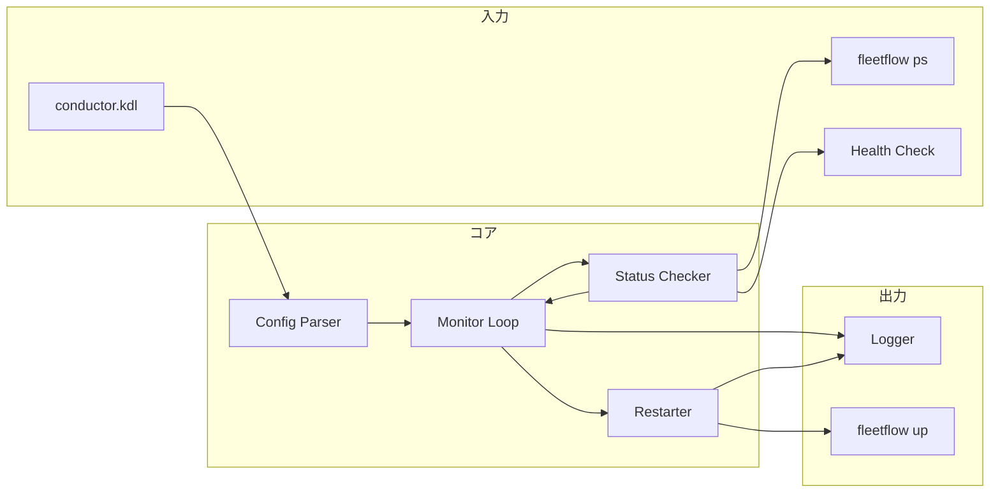

# システムアーキテクチャ - 設計書

## 設計思想: Simplicity（シンプルさ）

### 型の分類

- **data**: 設定、状態
- **calculations**: 状態判定、設定パース
- **actions**: プロセス起動、HTTP通信

### Straightforward原則

監視 → 判定 → アクション の単純なループ。

## データモデル

### 構造定義

```rust
/// サービスの状態
#[derive(Debug, Clone, PartialEq)]
pub enum ServiceStatus {
    Up,
    Down,
    Unknown,
}

/// 監視対象サービス
#[derive(Debug, Clone)]
pub struct Service {
    pub name: String,
    pub health_check: Option<String>,  // URL
    pub status: ServiceStatus,
    pub last_check: Option<Instant>,
    pub restart_count: u32,
}

/// 設定
#[derive(Debug, Clone)]
pub struct Config {
    pub interval_secs: u64,
    pub stage: String,
    pub services: Vec<ServiceConfig>,
}

#[derive(Debug, Clone)]
pub struct ServiceConfig {
    pub name: String,
    pub health_check: Option<String>,
}
```

### モデルの関係性



## アーキテクチャ

### コンポーネント構成



### コンポーネント詳細

#### Config Parser

**責務**: KDL設定ファイルのパース

```rust
pub fn parse_config(path: &Path) -> Result<Config, ConfigError>;
```

#### Monitor Loop

**責務**: 定期的な監視ループの実行

```rust
pub async fn run_monitor(config: Config) -> Result<(), MonitorError>;
```

#### Status Checker

**責務**: サービス状態の取得

```rust
pub async fn check_fleetflow_status(stage: &str) -> Result<Vec<ServiceStatus>, CheckError>;
pub async fn check_health(url: &str) -> Result<bool, CheckError>;
```

#### Restarter

**責務**: サービスの再起動

```rust
pub async fn restart_service(stage: &str, service: &str) -> Result<(), RestartError>;
```

## 実装手法

### 監視ループ

```mermaid
sequenceDiagram
    participant Loop as Monitor Loop
    participant Check as Status Checker
    participant FF as FleetFlow
    participant HC as Health Check
    participant Restart as Restarter

    loop Every interval
        Loop->>Check: check_all()
        Check->>FF: fleetflow ps
        FF-->>Check: container status

        opt has health_check
            Check->>HC: GET /health
            HC-->>Check: ok/error
        end

        Check-->>Loop: ServiceStatus[]

        alt status == Down
            Loop->>Restart: restart_service()
            Restart->>FF: fleetflow up
            FF-->>Restart: result
            Restart-->>Loop: ok/error
        end
    end
```

### エラーハンドリング

```rust
#[derive(Error, Debug)]
pub enum ConductorError {
    #[error("Config error: {0}")]
    Config(#[from] ConfigError),

    #[error("Check error: {0}")]
    Check(#[from] CheckError),

    #[error("Restart error: {0}")]
    Restart(#[from] RestartError),
}
```

### バックオフ戦略

```rust
fn calculate_backoff(restart_count: u32) -> Duration {
    let base = 5; // 秒
    let max = 300; // 5分
    let delay = base * 2u64.pow(restart_count.min(6));
    Duration::from_secs(delay.min(max))
}
```

## テスト戦略

### ユニットテスト

- [ ] Config パース
- [ ] バックオフ計算
- [ ] 状態判定ロジック

### 統合テスト

- [ ] FleetFlow連携
- [ ] ヘルスチェック
- [ ] 再起動フロー

## 実装チェックリスト

- [ ] プロジェクト初期化（Cargo.toml）
- [ ] 設定パーサー（kdl crate）
- [ ] FleetFlow状態取得（Command実行）
- [ ] ヘルスチェック（reqwest）
- [ ] 監視ループ（tokio）
- [ ] 再起動処理
- [ ] ログ出力（tracing）
- [ ] テスト

## 変更履歴

### 2024-12-15: 初版作成

- **理由**: conductor設計の明文化
- **影響**: 新規コンポーネント
