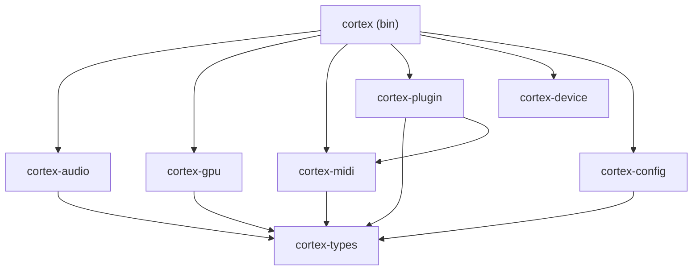

# クレート再設計: wave-* → cortex-*

## 日付
2026-02-16

## 概要

bikeboy-cortex のクレート構造をフルリデザインする。
`wave-*` プレフィックスを `cortex-*` に変更し、責務の分割を見直す。

## 動機

- プロジェクト名が `bikeboy-cortex` に変わったが、クレート名が `wave-*` のまま
- `wave-core` がオーディオ型・GPU型・エンコーダー設定を全て抱えている（God object）
- `wave-maru` は core に依存していないのに、構造上は同列
- エンコーダーとビジュアルが分かれているが、出力パイプラインとして一体

## 設計

### クレート構成（7クレート）

```
bikeboy/
├── src/main.rs              # cortex バイナリ
├── crates/
│   ├── cortex-types/        # 共有データ型（最小限）
│   ├── cortex-audio/        # オーディオパイプライン
│   ├── cortex-gpu/          # GPU + エンコード
│   ├── cortex-midi/         # MIDI入力
│   ├── cortex-plugin/       # プラグインホスティング
│   ├── cortex-device/       # MARUデバイス
│   └── cortex-config/       # プリセット + 設定
├── bikeboy-launcher/
└── bikeboy-mcp/
```

### 各クレートの責務

| クレート | 内容 | 外部依存 |
|---------|------|---------|
| **cortex-types** | AudioFrame, AnalysisData, FrequencyBand, AudioConfig, 共通エラー型 | bytemuck, serde, thiserror |
| **cortex-audio** | AudioDecoder, AudioPlayer, AudioAnalyzer, RingBuffer | cpal, symphonia, rustfft |
| **cortex-gpu** | Renderer, ShaderPipeline, ShaderUniforms, VideoEncoder, RenderConfig, EncoderConfig | wgpu, winit, (video-rs) |
| **cortex-midi** | MidiHandler, MidiController, MidiEvent | midir, midi-msg |
| **cortex-plugin** | PluginHost, PluginProcessor, EffectChain, Instrument, ParamBridge | rack |
| **cortex-device** | MaruServer, Wire Protocol, Volume制御 | tracing のみ |
| **cortex-config** | PresetManager, KDL設定 | knuffel, serde |

### 依存関係グラフ



### 移行マッピング

| 移行元 | 移行先 | 備考 |
|--------|--------|------|
| wave-core/audio.rs | cortex-types/ | AudioFrame, AnalysisData, AudioConfig, FrequencyBand |
| wave-core/shader.rs | cortex-gpu/ | ShaderUniforms, RenderConfig, EncoderConfig |
| wave-core/error.rs | cortex-types/ | 共通エラー型 |
| wave-audio/* | cortex-audio/ | そのまま移行 |
| wave-visual/* | cortex-gpu/ | ShaderUniforms + encoder統合 |
| wave-encoder/* | cortex-gpu/encoder.rs | gpu内モジュールとして統合 |
| wave-midi/* | cortex-midi/ | そのまま移行 |
| wave-plugin/* | cortex-plugin/ | 依存をcortex-midiに変更 |
| wave-maru/* | cortex-device/ | そのまま移行 |
| wave-preset/* | cortex-config/ | そのまま移行 |

### 設計原則

1. **cortex-types は外部クレートに依存しない**（bytemuck, serde のみ）
2. **cortex-device は完全独立**（他のcortex-*に依存しない）
3. **依存方向は一方向**（循環依存なし）
4. **ShaderUniforms は cortex-gpu に移動**（GPU専用の型だから）

## 追加作業

- [ ] bikeboy-cortex（壊れたワークツリー）ディレクトリを削除
- [ ] bikeboy-audio-engine（空ディレクトリ）を削除
- [ ] main.rs のウィンドウタイトルを "bikeboy-cortex" に修正
- [ ] main.rs のログメッセージを "bikeboy-cortex" に修正
- [ ] src/main.rs の use 文を新クレート名に更新
- [ ] CLAUDE.md のディレクトリ構造を更新
- [ ] spec/design ドキュメントの参照を更新
