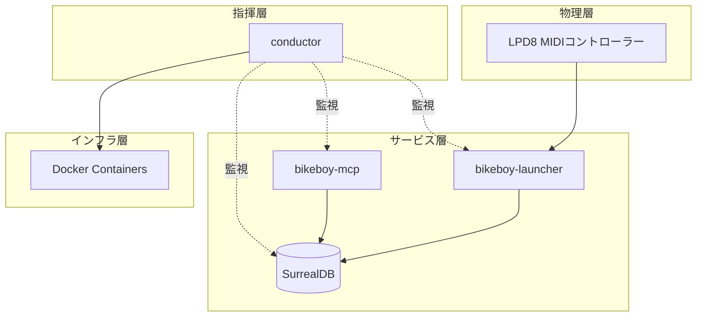

# bikeboy - コアコンセプト

## コンセプト

### ビジョン

LPD8 MIDIコントローラーを活用した、物理的なワークスペース管理システム。
パッドを押すだけで作業環境が一瞬で切り替わる、触覚的なコンピューティング体験を提供する。

### 哲学・設計原則

#### 言語選定方針

bikeboyプロジェクトでは、以下の優先順位で言語を選定する：

1. **Rust** - 第一選択
   - 軽量・高パフォーマンス
   - 信頼性（型安全、メモリ安全）
   - 常駐プロセス、システムレベルの処理に最適

2. **TypeScript** - 第二選択
   - 迅速な開発
   - MCPサーバー、Web関連に適する
   - Bunランタイムを使用（Node.jsは不採用）

3. **適材適所** - 第三選択
   - Swift: macOS固有のAPI（ウィンドウ管理、アクセシビリティ）
   - その他: 特定の要件に応じて

#### シンプルさの追求

- **Straightforward原則**: 入力から出力まで直線的に
- **最小限のステップ**: 不要な抽象化を避ける
- **型の分類**: data / calculations / actions

### システム概要図

## 仕様

### Context × Scene モデル

#### FS-001: Context（作業文脈）

**目的**: 作業の種類・モードを表現

**例**:
- 開発: コーディング環境
- 執筆: ドキュメント作成環境
- 会議: コミュニケーション環境

**振る舞い**:
- パッドを押すとContextが切り替わる
- 各Contextは独立したウィンドウ配置を持つ

#### FS-002: Scene（配置パターン）

**目的**: Context内のウィンドウ配置バリエーション

**振る舞い**:
- 同一Context内で複数のSceneを持てる
- 長押しでScene選択メニュー表示

### LPD8マッピング

| 入力 | 機能 |
|------|------|
| パッド1-8 | Context切り替え |
| パッド長押し | Scene選択 |
| ノブ1-8 | 各種調整（音量、輝度など） |

## 哲学的考察

### なぜ物理コントローラーか

キーボードショートカットは「覚える」必要があるが、物理パッドは「触る」だけで良い。
身体性を持った操作は、認知負荷を下げ、作業への没入を促進する。

### 進化の方向性

1. **短期**: 基本機能の安定化
2. **中期**: MIDIレイヤーのRust化
3. **長期**: 他のMIDIコントローラー対応

## 変更履歴

### 2024-12-15: 初版作成

- **理由**: プロジェクト開始にあたり、コアコンセプトを明文化
- **影響**: 全コンポーネント
