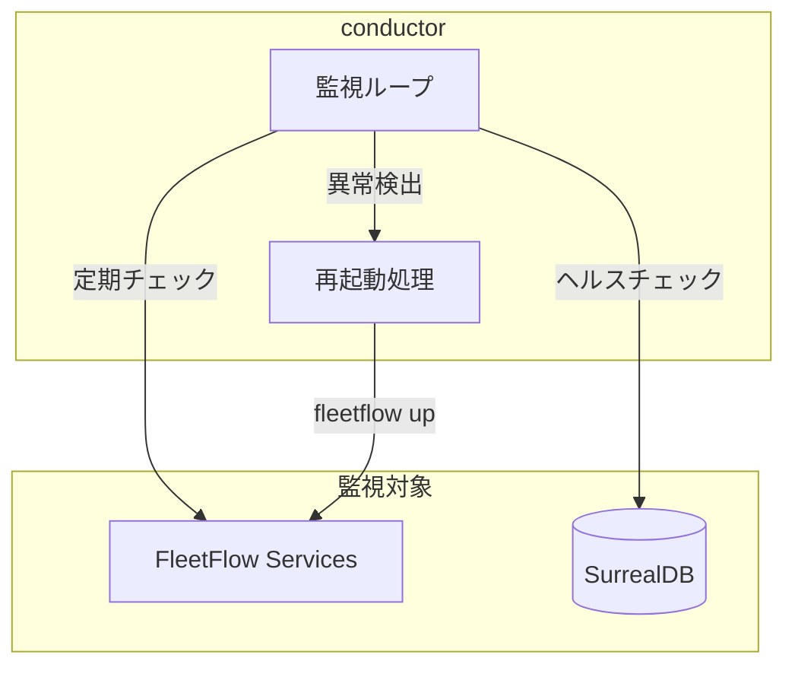

# conductor - 仕様書

## コンセプト

### ビジョン

bikeboyエコシステム全体を監視・制御する「指揮者」プロセス。
FleetFlowで定義されたサービスを監視し、ダウン時に自動復旧を行う。

### 哲学・設計原則

- **軽量**: 常駐プロセスとして最小限のリソース消費
- **自律的**: 人間の介入なしに問題を検出・復旧
- **透明**: 状態・アクションをログで可視化

### 他との違い

| ツール | 特徴 |
|--------|------|
| systemd | Linux専用、汎用的すぎる |
| supervisord | Python依存、設定が複雑 |
| **conductor** | Rust製、FleetFlow特化、軽量 |

### システム概要図



## 仕様

### 機能仕様

#### FS-001: サービス監視

**目的**: FleetFlowで定義されたサービスの稼働状態を監視

**入力**:
- `flow.kdl`の設定（サービス一覧）
- 監視間隔（デフォルト: 30秒）

**出力**:
- 各サービスの状態（Up / Down / Unknown）

**振る舞い**:
1. 定期的に`fleetflow ps`相当の状態取得
2. 状態変化があればログ出力
3. Downを検出したら再起動処理へ

#### FS-002: 自動再起動

**目的**: ダウンしたサービスを自動復旧

**振る舞い**:
1. Downを検出
2. `fleetflow up -s {stage}`を実行
3. 復旧確認
4. 連続失敗時はバックオフ（指数関数的に待機時間を増加）

**制約**:
- 最大再起動回数: 5回/時間
- バックオフ最大: 5分

#### FS-003: ヘルスチェック

**目的**: サービス固有のヘルスチェック

**対象**:
- SurrealDB: HTTP `/health` エンドポイント

### インターフェース仕様

```rust
// 設定ファイル（KDL形式）
// conductor.kdl

conductor {
    interval 30  // 秒
    stage "local"

    service "surrealdb" {
        health-check "http://localhost:8000/health"
    }
}
```

### 非機能仕様

- **パフォーマンス**: CPU使用率 < 1%、メモリ < 10MB
- **起動時間**: < 100ms
- **信頼性**: 24/7稼働、自身のクラッシュ時はlaunchdで再起動

## 哲学的考察

### なぜ専用ツールか

既存のプロセス監視ツールは汎用的すぎて設定が複雑。
FleetFlowに特化することで、シンプルかつ効果的な監視を実現。

### 進化の方向性

1. **Phase 1**: FleetFlowサービス監視（現在）
2. **Phase 2**: ネイティブプロセス監視（bikeboy-launcher等）
3. **Phase 3**: メトリクス収集・可視化

## 変更履歴

### 2024-12-15: 初版作成

- **理由**: サービス監視の必要性
- **影響**: 新規コンポーネント
